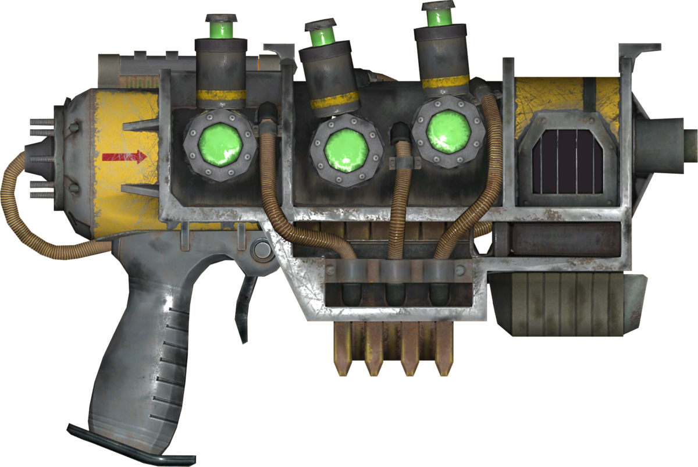

<p>

<h1> COIGAN controllable object inpainting</h1>
</p>
</br>
Project that aim to realize a GAN model capable of coherent objects inpainting inside a given image. This project took a lot from these two repositroies:

- [Swagan](https://github.com/rosinality/stylegan2-pytorch) A pytorch implementation of Stylegan2 based on wavelets, without progressive growing.
- [Lama](https://github.com/advimman/lama) A pytorch implementation of a GAN model for inpainting, that exploit the Fourier transform.

# Model results

These images are a batch of 8 inputs and 8 outputs of the model, extracted from the 95000 step of one of the training sessions.


The iamge show (left) the base images used for the inpainting process, (center) the mask concatenated to the base images, giving to the model a reference where to apply the defects (note: as a semplifications more classes are collapsed into one single maps, but the masks are splitted in 4 classes/channels in the training), (right) the output of the model, that is the inpainted image.

# Install the COIGAN module
In this section is expleined how to install the COIGAN module in your system, with all his dependencies.

### Create a virtual environment
A suggested approch is to create a virtual environment and install the module and his dependencies in it, to avoid conflicts with other projects.
To create a virtual environment you can use the following commands:
```bash
cd /<project_target_path>/COIGAN-controllable-object-inpainting
python3 -m venv .env
source .env/bin/activate

# here you can install the module and his dependencies...

# to deactivate the virtual environment
deactivate
```
### Install torch and torchvision
The project is tested with CUDA 11.5, and with the following version of torch and torchvision:
- torch 1.2.1+cu116
- torchvision 0.13.10.13.1+cu116

You can install these versions with the following command, considering a Linux system with CUDA 11.6 or 11.5 installed:
```bash
pip install torch==1.12.1+cu116 torchvision==0.13.1+cu116 --extra-index-url https://download.pytorch.org/whl/cu116
```

### Install the COIGAN module
To install the COIGAN module you need to clone the repo and install it with pip, so follow the commands listed below to install the module in your system:

```bash
cd /<project_target_path>/
git clone https://github.com/MassimilianoBiancucci/COIGAN-controllable-object-inpainting.git
cd COIGAN-controllable-object-inpainting
pip install -e COIGAN
```
Now the module is installed, follow the command bellow if you need to uninstall it:
```bash
pip uninstall COIGAN
```

# Prepare the Severstal steel defect dataset

## Setup the kaggle api
The first thing to do before the dataset preparation is to install and setup the kaggle api credentials, **if you already have the kaggle-api installed jump this step**.

install the the kaggle api in you system:
```bash
pip install kaggle
```
Now you need to retrive the username and the API-KEY and follow one of the following options:
- **options 1**: You can setup 2 env vars, one for the 
    ```bash
    export KAGGLE_USERNAME=datadinosaur
    export KAGGLE_KEY=xxxxxxxxxxxxxx
    ```
- **option 2**: You can setup a json file in the kaggle api files folder
    ```yaml
    /home/<username>/.kaggle/kaggle.json
    ```
    in the above file you need to add the user name and the API_KEY this way
    ```json
    {
        "username":"xxxxxxxxxxxxxx",
        "key":"xxxxxxxxxxxxxx"
    }
    ```
- **option 3**: You can download the zip file by yourself at the [the challenge page](https://www.kaggle.com/competitions/severstal-steel-defect-detection) and put it in the folder: 
    ```yaml
    /<your_path>/COIGAN-controllable-object-inpainting/data/severstal-steel-defect-detection
    ```

If you have any trouble with the kaggle api setup, refer to this link where the procedure is explained in detail: [Kaggle api repo](https://github.com/Kaggle/kaggle-api) or follow the option 3.
</br></br>

## Run the dataset preparation script
The first thing to do before launch the preparation script is to change the var **repo_dir** to the path of the repo in your local es: 

```yaml
repo_dir: /home/ubuntu/COIGAN-controllable-object-inpainting
```

the var is present inside the config file: 

```yaml
/home/ubuntu/COIGAN-controllable-object-inpainting/configs/data_preparation/severstal_dataset_preparation.yaml
```
</br>

### Data preparation settings
In this section are explained the principal variables of the dataset preparation script, to customize the dataset generated.
You can find those variables in the config file: 
```yaml
/your_path/COIGAN-controllable-object-inpainting/configs/data_preparation/severstal_dataset_preparation.yaml
```
Here the more interesting variables:

- **dataset_name**: name of the dataset, it will be used to create the folder where the generated dataset will be saved. The actual path will be `/<your_path>/COIGAN-controllable-object-inpainting/datasets/severstal-steel-defect-detection/<dataset_name>`
- **repo_dir**: path of the repo in your local, specify the main path of the COIGAN repo, es: `/<your_path>/COIGAN-controllable-object-inpainting`.
- **original_tile_size**: size of the original tile, for original tile is intended the dimension of the images in the input dtaset, for the severstal dataset is 1600x256, do not change this value.
- **tile_size**: size of the tile that will be generated, the tile will be cropped from the original tile, so the tile size must be smaller than the original tile size. This can be changed if you want a model with a different output shape.
- **binary**: This parameter specify if the datasets generated will be in binary json format, if set to True the read(+30%) and write(+150%) operations will be faster, and the dataset will be smaller in size.
- **n_workers**: number of workers used where the multithreading approach is used. -1 means that all the available cores will be used.
- **split_mode**: random or fair, specify the method used to split the samples in two sets, if **fair** is selected, the algorith try to create a train and test set with the same proportion of each class, and defected and non-defected samples. If **random** is selected, the samples are randomly splitted in two sets. 
- **train_ratio**: Specify how many samples will be placed in the train set from the original dataset, the value must be between 0 and 1.
- **test_ratio**: Specify how many samples will be placed in the test set from the original dataset, the value must be between 0 and 1.
- **black_threshold**: From the train dataset will extracted the samples without defects, to create a base dataset used as base for the inpainting process, but in the dataset there are images with big black areas, not suitable for the process, so this parameter specify the threshold used to segment the black area (consider 0 is totally black and 255 is totally white).
- **black_area_max_coverage**: Specify the maximum allowed extension of the black area on a sample, if greather than this value the sample won't be added to the base dataset.
</br></br>

# Train a COIGAN model
Before running the coigan training there are a few things to do, other than the dataset preparation. One step is to download the model used for the perceptual loss, and you need to review the training settings, changing the path of the COIGAN repo in the training configs.
</br>

## Download the needed models
For running the COIGAN training script and use the Resnet perceptual loss, you need to download the resnet50 model from the MIT Scene Parsing Benchmark dataset, you can download it running the script `download_models_loss.py` in the `COIGAN-controllable-object-inpainting/scripts` folder. NOTE: you should change the var `repo_dir` in the script to the path of the repo in your local es: 

```python
repo_dir= "/<your_path>/COIGAN-controllable-object-inpainting"
```

Then run the download script:

```bash
python download_models_loss.py
```
This will create a folder in the project root called `models_loss/ade20k/ade20k-resnet50dilated-ppm_deepsup` with inside the model checkpoint used for the loss. 

## Setup the configuration files
Before running the training script you need to setup the config files with your specific settings, the file of interest for the triaining can be found under the path:
```yaml 
/<your_path>/COIGAN-controllable-object-inpainting/configs/train
```
The most important variable to change is in the file:
```yaml 
/<your_path>/COIGAN-controllable-object-inpainting/configs/train/location/default_locatons.yaml
```
In this file the var `project_home` must be changed to the path of the repo in your local path for the COIGAN repo, so all the other paths will be correctly set,
and the scripts will work in this folder.

The other variables that could be interesting to change are:
- **conf_name**: name of the configuration, it will be used to create the folder where the training logs will be saved.
- **checkpoint**: path of the checkpoint to load, if you want to continue the training from a previous checkpoint, or if you want to use a pretrained model. In such a case the checkpoint file must have the name with the format: <epoch>.pt ex: 95000.pt
- **max_iter**: number of steps of the training.
- **batch_size**: batch size used for the training, for each thread if distributed data parallel is used.
- **num_workers**: number of workers used for the dataloader, if distributed data parallel is used, the number of workers will be multiplied by the number of gpus.
- **gen_steps**: number of consecutive generator steps before pass to the discriminator steps.
- **disc_steps**: number of consecutive discriminator steps before pass to the generator steps.
- **use_g_ema**: if True the generator will use the exponential moving average of the generator weights, saving g_ema model in the checkpoints.
- **use_ref_disc**: if True, in addition to the defects discriminator will be used a second discriminator that will be trained to reduce the distance between the original tile training dataset images, and the generated images. (this reduce the artifacts but introduce some morfological changes  in the generated images, respect the base images, even where there are no inpainting masks).
- **mask_base_img**: if True, the base image will be passed to the generator with the areas to inpaint set to 0, if False the base image will be passed as it is.
- **input_mask_noise_mean**: mean of the gaussian noise added to the input mask, if 0 no noise will be added.
- **input_mask_noise_std**: standard deviation of the gaussian noise added to the input mask, if 0 no noise will be added.
- **input_mask_noise_smooth**: size of the linear filter used to generate a smoothed version of the input mask before adding the noise, if 0 no smoothing will be applied.
- **distributed**: if True the training will be distributed on multiple gpus with distributed data parallel, if False the training will be run on a single gpu.
- **enable_wandb**: if True the training will be logged on wandb, if False the training will not be logged on wandb. Note: the wandb settings are in the file:
```yaml
/<your_path>/COIGAN-controllable-object-inpainting/configs/train/logger/default_logger.yaml
```
- **log_img_interval**: number of steps between each image logging.
- **log_weights_interval**: number of steps between each weights and gradients logging.
- **checkpoint_interval**: number of steps between each checkpoint saving.
- **log_shapes_and_defects**: if True the shapes and defects used in the training process will be logged to wandb on the imgs log, if False the shapes and defects will not be logged in the training.
  
Under the field **defaults** are specified all the subfields that link through the hydra library other files, with specific settings:
- **generator**: contains the settings for the generator, like the num of input channels or the number of blocks.
- **discriminator**: contains the settings for the discriminator, like the num of input channels or the input size of the model.
- **optimizers**: contains the settings for the optimizers, for all the models used in the training (generator, discriminator, ref_discriminator).
- **losses**: contains the settings for the losses, for all the losses used in the training, mainly the weights for each loss, and some other parameter for some special loss.

## The losses
as specified in the file:
```yaml
/<your_path>/COIGAN-controllable-object-inpainting/configs/train/losses/default_losses.yaml
```
There are all the parameters to tweak the losses used in the training, the losses supported in the training pipeline are:
- **l1**: L1 loss, used for the reconstruction of the inpainted image.
- **l1_smooth_masked**: L1 loss, used for the reconstruction of the inpainted image, applying a smoothed weighted mask to the loss pixel wise, allowing to specify how the weight varies from the center of the mask to the border, and the weights of the base and inpainted objects.
- **adversarial**: adversarial loss, is the loss that use the discriminator to evaluate the quality of the defects generated by the generator.
- **ref_adversarial**: adversarial loss, is the loss that use the ref_discriminator to evaluate the general distance fo the entire image generated by the generator, from the original images.
- **resnet_perceptual**: resnet perceptual loss, is the loss that use the resnet50 model to evaluate the distance of the generated image from the base image passed as input, evaluating the resnet inference features.
- **resnet_pl_smooth_masked**: resnet perceptual loss, is the loss that use the resnet50 model to evaluate the distance of the generated image from the base image passed as input, evaluating the resnet inference features, applying a smoothed weighted mask to the loss pixel wise, allowing to specify how the weight varies from the center of the mask to the border, and the weights of the base and inpainted objects.
- **generator_reg**: generator regularization, is the path length regularization loss.
  
- **discriminator_losses:logistic**: discriminator logistic loss, is the loss used by the discriminator to evaluate the quality of the defects generated by the generator.
**discriminator_reg**: discriminator regularization, is the path length regularization loss, the R1 regularization loss is used.

- **ref_discriminator_losses:logistic**: ref discriminator logistic loss, is the loss used by the ref_discriminator. (used only if use_ref_disc is True)
- **ref_discriminator_reg**: ref discriminator regularization, is the path length regularization loss, the R1 regularization loss is used. (used only if use_ref_disc is True)

## Launch the training script
To launch the training script and train a COIGAN model you only need to run the script `train.py` in the `COIGAN-controllable-object-inpainting/scripts` folder.
